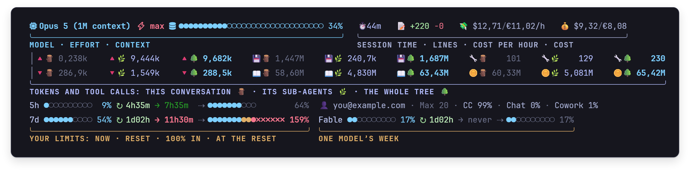
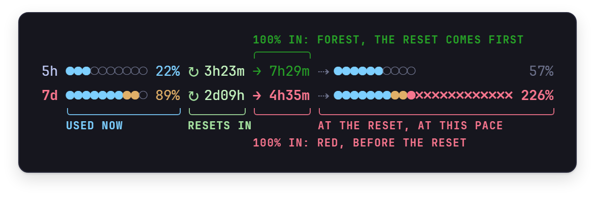
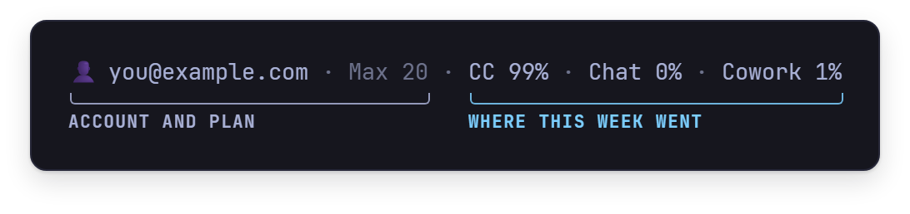
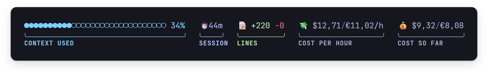
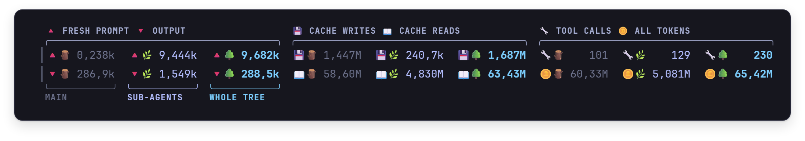
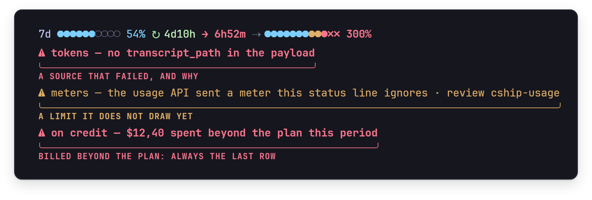
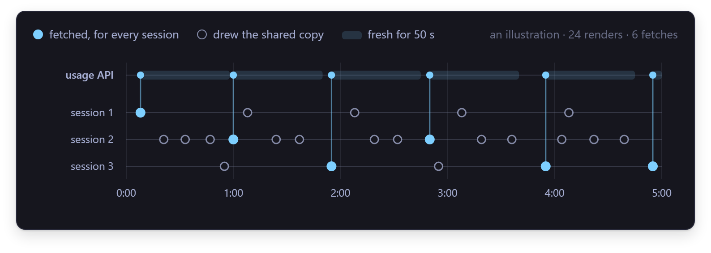
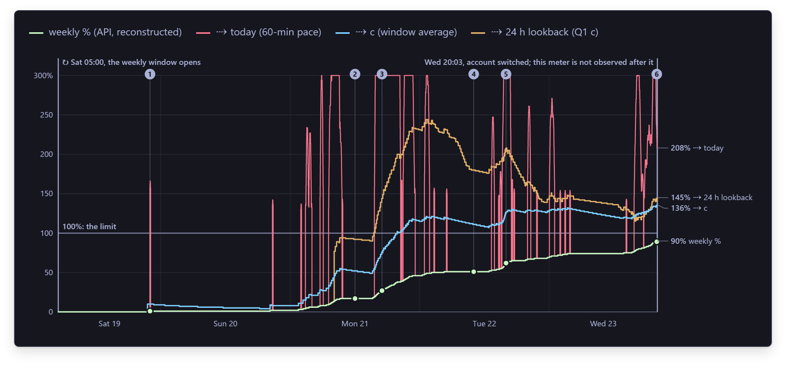

<div align="center">

# StatusAI

**A status line for Claude Code that shows what your whole agent tree is spending —**<br>
**every sub-agent's tokens, where your usage limits are heading, and what the session costs.**

<a href="https://github.com/SixFive7/StatusAI/releases/latest"></a>

<sub>For Claude Code on Windows 10 and 11 · [install guide](docs/guide/install.md) · [what every glyph means](docs/guide/reading-the-status-line.md) · [changelog](CHANGELOG.md)</sub>

</div>



## Why you'll like it

- **It counts the whole tree.** The token figures Claude Code hands a status line cover the main
  conversation only, and every sub-agent writes a transcript of its own. StatusAI reads all of them,
  at any depth, and counts each API response exactly once. In three real sessions the sub-agents
  spent 28%, 78% and 98% of the tokens.
- **It sees your limits coming.** Every limit says how soon it reaches 100% at the pace of the last
  hour — red when that is before it resets, forest green when the reset comes first — and where it
  will stand when it does reset.
- **It never shows a missing figure as a zero.** A figure it could not read shows `—` instead, and
  a red row says which source failed and why.
- **It stays out of the way.** One native `.exe` that needs no .NET installed, and every Claude Code
  session you have open shares a single usage fetch.

## A tour

### Your limits, and where they're heading



Three rows: the five-hour session, the week, and the week for one model. Each shows how much is used,
when it resets (`↻`), how soon it reaches 100% at the pace of the last hour (`→`), and where it
will stand at the reset (`⇢`), growing red `✗` cells past 100%. The time to 100% is **red** when it
comes before the reset — you will run out — and **forest green** when the reset comes first, so at
this pace you won't.

### Where your week went



Your account and plan, then how this week's usage splits across Claude Code, chat and Cowork, as
Anthropic's usage API reports it. The split is shown in whole entries or not at all, so the line
never wraps.

### Context, time and money



[cship](https://github.com/stephenleo/cship) draws the model, the effort level and how full the
context is. StatusAI adds how long the session has run, the lines it changed, and what it costs an
hour and so far, in dollars and euros. The cost is Claude Code's own list-price estimate for the
whole tree: on a subscription, a gauge of effort rather than a bill.

### Every token, in two rows



What went out on top — fresh prompt, cache writes, tool calls — and what came back below: output,
cache reads, and every token together. Each kind has three columns: this conversation 🪵, its
sub-agents 🌿, and the whole tree 🌳, in dim, lavender and bold cyan, so a scope reads straight
down.

### Warnings that say why



A figure that could not be read gets a red `⚠` row naming its source and why, instead of a zero
that looks real. An amber row appears when Anthropic's usage API sends a limit StatusAI does not
draw yet, and a red alarm, always last, if your usage is ever billed beyond your plan.

### One fetch for all your sessions



Open as many sessions as you like: they share one copy of your usage. A session fetches a new one
only when the shared copy is 50 seconds old, and only one fetches at a time; the others draw the
shared copy rather than wait.

## Get it

**[Download the latest release](https://github.com/SixFive7/StatusAI/releases/latest)**: a zip with
`cship-usage.exe` and its configuration. You need

- Windows 10 or 11, on x64;
- Claude Code, signed in with your Claude account;
- a terminal that draws emoji two columns wide, such as Windows Terminal;
- a [Nerd Font](https://www.nerdfonts.com), such as JetBrainsMono Nerd Font, for the model line's two
  icons;
- [cship](https://github.com/stephenleo/cship) 1.8.0, which draws the model line StatusAI's rows go
  under. The install block fetches it for you.

Then:

1. **Extract the zip, open PowerShell in that folder, and paste the block** from the
   [install guide](docs/guide/install.md#download). It puts `cship-usage.exe` and cship in
   `%USERPROFILE%\.local\bin`, which has to be on your PATH, and `cship.toml` in
   `%USERPROFILE%\.config`.
2. **Tell Claude Code**, in `%USERPROFILE%\.claude\settings.json`:

   ```json
   "statusLine": { "type": "command", "command": "cship-usage", "refreshInterval": 60 }
   ```

   If your terminal is not 141 columns wide, add its width: `"env": { "CSHIP_WIDTH": "120" }`.
3. **Restart Claude Code.**

**Early days.** This is 0.1.0. Numbers are in Dutch notation (`1.234,56`), the token grid needs a
terminal at least 121 columns wide, and there is no installer or auto-update yet.

## Learn more

- [Reading the status line](docs/guide/reading-the-status-line.md): every row, glyph and colour.
- [Install](docs/guide/install.md): the download, building from source, the optional prompt line,
  and taking it out again.
- [All the documentation](docs/README.md): how the tokens are counted, how the forecast is made, and
  why it all looks the way it does.
- [Changelog](CHANGELOG.md).

## How it was designed



The limit rows were designed in the open: every option drawn to the character before one was
built, with its width counted, and the hard calls settled on evidence. This chart is from the
[limit-row decisions page](docs/design/limits-decisions.html): the week of 19 to 23 September,
replayed minute by minute, to test a steadier forecast against the one on the status line. The
steadier one was more accurate, and it still lost; the page shows why. It is a single HTML file,
which GitHub shows as source: download it and open it in a browser.

---

<sub>StatusAI is built on [cship](https://github.com/stephenleo/cship) (Apache-2.0) and, for the
optional prompt line, [starship](https://starship.rs) (ISC). It was built in Claude Code. No licence
has been chosen for StatusAI itself yet.</sub>
