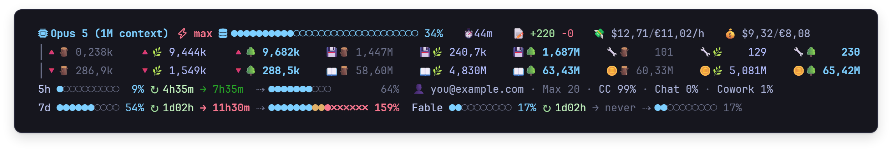

<div align="center">

# StatusAI

**A status line for Claude Code that shows what your whole agent tree is spending:**<br>
**every sub-agent's tokens, where your usage limits are heading, and what the session costs.**



<a href="https://github.com/SixFive7/StatusAI/releases/latest"></a>

</div>

## What you're looking at

<div align="center">

<a href="docs/guide/reading-the-status-line.md"></a>

**[Reading the status line](docs/guide/reading-the-status-line.md)**

</div>

## Why you'll like it

- It counts the whole tree. Claude Code only gives a status line the tokens of the main
  conversation, while every sub-agent writes a transcript of its own. StatusAI reads all of them,
  at any depth, and counts each API response once. In three real sessions the sub-agents used 28%,
  78% and 98% of the tokens.
- It shows your limits coming. Each limit says how soon it reaches 100% at the pace of the last
  hour, in red if that is before it resets and in forest green if the reset comes first, and where
  it will stand when it resets.
- It never shows a missing figure as a zero. You get `—` instead, plus a red row that says which
  source failed and why.
- It stays out of the way. It is one native `.exe` that needs no .NET installed, and all your open
  Claude Code sessions share a single usage fetch.

## A tour

### Your limits, and where they're heading


There are three rows: the five-hour session, the week, and the week for one model. Each one shows
how much is used, when it resets (`↻`), how soon it reaches 100% at the pace of the last hour (`→`),
and where it will stand at the reset (`⇢`), with red `✗` cells for anything past 100%. The time to
100% is **red** when it comes before the reset, which means you will run out, and **forest green**
when the reset comes first, so at this pace you won't.

### Where your week went


Your account and plan, then how this week's usage splits across Claude Code, chat and Cowork, as
Anthropic's usage API reports it. The split is shown in whole entries or not at all, so the line
never wraps.

### Context, time and money


[cship](https://github.com/stephenleo/cship) draws the model, the effort level and how full the
context is. StatusAI adds how long the session has run, the lines it changed, and what it costs per
hour and so far, in dollars and euros. The cost is Claude Code's own list-price estimate for the
whole tree, so on a subscription it is a gauge of effort rather than a bill.

### Every token, in two rows


The top row is what went out (fresh prompt, cache writes, tool calls) and the bottom row is what
came back: output, cache reads, and all tokens together. Each kind has three columns, this
conversation 🪵, its sub-agents 🌿 and the whole tree 🌳, in dim, lavender and bold cyan, so you can
read one scope straight down.

### Warnings that say why


When a figure could not be read, you get a red `⚠` row naming its source and the reason, not a zero
that looks real. An amber row appears when Anthropic's usage API sends a limit StatusAI does not
draw yet, and a red alarm, always last, if your usage is ever billed beyond your plan.

### One fetch for all your sessions


Open as many sessions as you like: they share one copy of your usage. A session only fetches a new
one when the shared copy is 50 seconds old, and only one session fetches at a time; the others draw
the shared copy rather than wait.

## Get it

**[Download the latest release](https://github.com/SixFive7/StatusAI/releases/latest)**, a zip with
`cship-usage.exe` and its configuration.

You need:

- Windows 10 or 11 on x64
- Claude Code running in a terminal, signed in with your Claude account. The chat panel of the
  VS Code extension shows no status line, but Claude Code in VS Code's own terminal does.
- A terminal that draws emoji two columns wide, such as Windows Terminal, with a
  [Nerd Font](https://www.nerdfonts.com) such as JetBrainsMono Nerd Font for the two icons on the
  model line
- [cship](https://github.com/stephenleo/cship) 1.8.0, which draws the model line that StatusAI's
  rows sit under. The install block fetches it for you.

Then:

1. Extract the zip and open PowerShell in the extracted folder. If your browser warns that the zip
   is not commonly downloaded, keep it: it is new and unsigned. On Windows 11, right-click inside
   the extracted folder and choose *Open in Terminal*.
2. Paste the block from the [install guide](docs/guide/install.md#download). It puts
   `cship-usage.exe` and cship in `%USERPROFILE%\.local\bin`, which has to be on your PATH, and
   `cship.toml` in `%USERPROFILE%\.config`.
3. Tell Claude Code about it: add this entry to `%USERPROFILE%\.claude\settings.json`, inside its
   outer braces.

   ```json
   "statusLine": { "type": "command", "command": "cship-usage", "refreshInterval": 60 }
   ```

4. Restart Claude Code.

The [install guide](docs/guide/install.md) has each step in full, what to expect at first,
[what to do when something is missing](docs/guide/install.md#when-something-is-missing), and how to
take it out again.

It's early days: this is 0.1.0. Numbers are in Dutch notation (`1.234,56`), the token grid needs a
terminal at least 121 columns wide, and there is no installer or auto-update yet.

## Learn more

- [Reading the status line](docs/guide/reading-the-status-line.md): every row, glyph and colour.
- [Install](docs/guide/install.md): the download step by step, the optional prompt line, and
  building from source.
- [All the documentation](docs/README.md): how the tokens are counted, how the forecast is made, and
  why it all looks the way it does.
- [Changelog](CHANGELOG.md).

## How it was designed


Every option for the limit rows was drawn to the character, with its width counted, before one of
them was built, and the difficult choices were made on measurements. This chart comes from the
[limit-row decisions page](docs/design/limits-decisions.html): the week of 19 to 23 September,
replayed minute by minute to test a steadier forecast against the one on the status line. The
steadier one was more accurate and still lost; the page explains why. It is a single HTML file,
which GitHub shows as source, so download it and open it in a browser.

---

<sub>StatusAI is built on [cship](https://github.com/stephenleo/cship) (Apache-2.0) and, for the
optional prompt line, [starship](https://starship.rs) (ISC). No licence has been chosen for StatusAI
itself yet.</sub>
