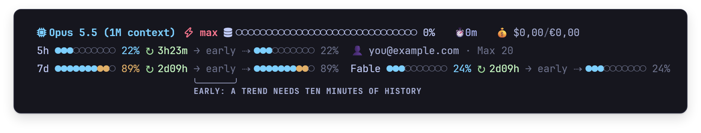

<sub>[StatusAI](../../README.md) / [Documentation](../README.md)</sub>

# Install

There is no installer yet. Each release is a zip on GitHub holding `cship-usage.exe` and the
configuration it is used with, and this page puts them in place with a short PowerShell block you
can read before you paste it. The block also fetches [cship](https://github.com/stephenleo/cship),
which draws the model line that StatusAI's rows sit under, from cship's own release. Building from
source is the [second path](#build-from-source). The plan for a one-click install with auto-update
is [packaging-plan.md](../design/packaging-plan.md).

## Before you start

- Windows 10 or 11, x64. There is no ARM64 build.
- Claude Code in a terminal. The status line belongs to Claude Code's command-line interface, in
  Windows Terminal or in VS Code's own terminal; the VS Code extension's chat panel does not show
  one.
- Claude Code signed in with a Claude account. The limit rows and the account line read the sign-in
  Claude Code keeps in `%USERPROFILE%\.claude`. With an API key the token rows still work, and the
  account line reads `👤 not signed in`.
- A terminal that draws emoji two columns wide, as Windows Terminal does. The token grid is laid out
  on that assumption.
- The status line fits the terminal's width, which Claude Code passes to it from version 2.1.153
  on. With an older Claude Code it assumes 141 columns, unless you give it a width (step 4).
- Numbers are in Dutch notation, `1.234,56` and `$9,32`, and there is no setting for that yet.
- For cship, the Microsoft Visual C++ Redistributable. cship is built against it and cannot start
  without it. Windows does not include it, but most PCs have it from some other program, and the
  block checks.
- Neither `cship-usage.exe` nor cship is signed. The block checks the cship it downloads against a
  pinned SHA-256, and each release publishes the zip's own. Your browser may warn that the zip is
  not commonly downloaded: in Edge choose *Keep*, then *Keep anyway*; in Chrome, *Download
  suspicious file*. The block removes the mark Windows puts on downloaded files, and Claude Code
  starts both programs directly, never through Explorer, so SmartScreen's *Windows protected your
  PC* does not come up.
- **Smart App Control blocks them.** Where Windows Security > *App & browser control* >
  *Smart App Control settings* says *On*, Windows 11 blocks unsigned programs it does not know,
  however they are started, and has no way to allow just one, so the status line cannot run until
  it is set to *Off*.
  That lowers the protection for every program; recent Windows 11 updates let you switch it on
  again on the same page, where before only a reset of Windows could. *Evaluation* blocks nothing.

## Download

The repository is private for now, so the download works only for people who have access to it.

1. Download `StatusAI-<version>-win-x64.zip` from the
   [latest release](https://github.com/SixFive7/StatusAI/releases/latest) and extract it: in
   Explorer, right-click it and choose *Extract All*. The release lists the zip's SHA-256 in
   `StatusAI-<version>-win-x64.zip.sha256`, and `Get-FileHash <zip>` prints the one you have.
2. Open PowerShell in the extracted folder and paste this block. On Windows 11, right-click inside
   the folder and choose *Open in Terminal*; on Windows 10, choose *File* > *Open Windows
   PowerShell*. Windows PowerShell 5.1, which every Windows 10 and 11 has, and PowerShell 7 both run
   it; if Windows Terminal warns that the text has several lines, paste it anyway.

   ```powershell
   & {
     $ErrorActionPreference = 'Stop'
     if (-not (Test-Path .\cship-usage.exe)) { throw 'Run this in the folder the zip was extracted to.' }
     $bin  = "$env:USERPROFILE\.local\bin"
     $conf = "$env:USERPROFILE\.config"
     New-Item -ItemType Directory -Force -Path $bin, $conf | Out-Null

     # cship 1.8.0, the version the render tests pin, from its own release, checked by SHA-256
     $url  = 'https://github.com/stephenleo/cship/releases/download/v1.8.0/cship-x86_64-pc-windows-msvc.exe'
     $want = 'fc0b77fb9a43a72ae3040ee956674fb2a94523dacdfb1ae411810fc0d7b562c0'
     $ProgressPreference = 'SilentlyContinue'
     Invoke-WebRequest $url -OutFile "$bin\cship.download" -UseBasicParsing
     $got = (Get-FileHash -Algorithm SHA256 "$bin\cship.download").Hash
     if ($got -ne $want) {
       Remove-Item "$bin\cship.download"
       throw "The cship download has SHA-256 $got, not $want. Nothing was installed."
     }

     Copy-Item .\cship-usage.exe $bin -Force
     Move-Item "$bin\cship.download" "$bin\cship.exe" -Force
     Unblock-File "$bin\cship-usage.exe", "$bin\cship.exe"
     if (Test-Path "$conf\cship.toml") { Write-Warning "$conf\cship.toml exists and was left as it is." }
     else { Copy-Item .\cship.toml $conf }
     $v = try { & "$bin\cship.exe" --version 2>$null } catch { }
     if ("$v" -notlike 'cship*') {
       Write-Warning 'cship.exe does not start here: see "When something is missing" in the guide.'
     }
     $found = Get-Command cship-usage -ErrorAction SilentlyContinue | Select-Object -First 1 -ExpandProperty Source
     if ($found -eq "$bin\cship-usage.exe") { "Done. PATH leads to $found." }
     else { Write-Warning "Done, but PATH does not lead to $bin\cship-usage.exe: see step 3." }
   }
   ```

   It puts `cship-usage.exe` in `%USERPROFILE%\.local\bin`, downloads cship beside it as
   `cship.exe`, and stops before installing anything if the download's SHA-256 is not the one
   above. It removes the mark Windows puts on downloaded files from both programs, and copies
   `cship.toml`, which draws the model line and the context bar, to `%USERPROFILE%\.config`. cship
   reads it there, or from `.config` under `HOME` when that variable is set; with none it draws
   nothing, and the status line says so in a `⚠` row. Then it starts cship once, to ask its
   version, and warns if cship cannot start on this PC.

   cship-usage runs the `cship.exe` in its own folder before any on your PATH, which is why the
   download is saved under that name beside it. With no cship to run, the status line prints the
   raw session JSON in place of the model line. Do not run cship's own installer or
   `cship uninstall`: both delete the `statusLine` setting that points at cship-usage.

   If you already have a `cship.toml`, the block leaves it as it is and says so. The status line's
   rows go under whatever your configuration draws, so it works as it is; for the model line and
   the context bar these pages show, replace it with the one in the zip, or copy the sections you
   want from it.
3. `%USERPROFILE%\.local\bin` has to be on your PATH, because `settings.json` names the command
   without a folder. The block's last line says whether it is. Claude Code's native installer puts
   `claude.exe` in that folder, so if `where.exe claude` prints
   `C:\Users\<you>\.local\bin\claude.exe`, the folder is on your PATH already. If it prints another
   folder or nothing, as it does when Claude Code came only with the VS Code extension, add the
   folder the way Claude Code's
   [Verify your PATH](https://code.claude.com/docs/en/troubleshoot-install#verify-your-path)
   describes, and start Claude Code from a new terminal: a program keeps the PATH it started with.
4. Tell Claude Code about it in `%USERPROFILE%\.claude\settings.json`. The entry goes inside the
   file's outer braces, with a comma between it and any setting already there; if there is no such
   file, create it with the entry between `{` and `}`.

   ```json
   "statusLine": { "type": "command", "command": "cship-usage", "refreshInterval": 60 }
   ```

   There is no width to set: StatusAI takes the terminal's from Claude Code. If you want a fixed
   width all the same, add it too, in the `env` block if the file has one already; it wins over the
   terminal's. In PowerShell, `$Host.UI.RawUI.WindowSize.Width` prints the width of the window it
   runs in.

   ```json
   "env": { "CSHIP_WIDTH": "120" }
   ```

5. Restart Claude Code.

To update, download the new release and run the block again with Claude Code closed. Windows locks
`cship-usage.exe` for the moment the status line runs it, and a copy made in that moment fails.
Your `cship.toml` is kept.

## Build from source

### Build

The [.NET 10 SDK](https://dotnet.microsoft.com/download/dotnet/10.0), and Visual Studio 2022 or
later with its *Desktop development with C++* workload, which
[NativeAOT needs](https://learn.microsoft.com/dotnet/core/deploying/native-aot/#prerequisites) to
link. Then:

```powershell
dotnet publish src/cship-usage.csproj -c Release -r win-x64 -o <dir>
```

`<dir>\cship-usage.exe` is the whole program: NativeAOT, self-contained, about 5 MB, with no .NET
runtime to install. Check it with the [render tests](../development.md#the-render-tests) before
putting it anywhere.

### Put it in place

1. Download [cship](https://github.com/stephenleo/cship) 1.8.0,
   `cship-x86_64-pc-windows-msvc.exe` from its
   [release](https://github.com/stephenleo/cship/releases/tag/v1.8.0), and save it as `cship.exe`
   **in the same directory as `cship-usage.exe`**, on your `PATH` (`%USERPROFILE%\.local\bin`, for
   instance). cship-usage runs the cship beside it; if there is none, the status line prints the
   raw session JSON instead. Do not run cship's own installer or `cship uninstall`: both delete the
   `statusLine` setting that points at cship-usage.
2. Copy [config/cship.toml](../../config/cship.toml) to `%USERPROFILE%\.config\cship.toml`. It
   draws the model line and the context bar.
3. Tell Claude Code about it and restart it, as in steps 4 and 5 of [Download](#download).

## The prompt line (optional)

[starship](https://starship.rs) adds a prompt line above the model line: the directory, git, the
language versions, RAM, the GPU and the time. Install starship, copy `starship.toml`, from the zip
or [config/starship.toml](../../config/starship.toml), to `%USERPROFILE%\.config\starship.toml`, and
use a [Nerd Font](https://www.nerdfonts.com) such as JetBrainsMono Nerd Font in the terminal. The
GPU figure comes from `nvidia-smi`, so it needs an NVIDIA GPU. starship reads that same file for
your shell prompt, so if you have one already, keep it or merge the two.

Without starship the prompt line is simply not drawn and everything else is unchanged. Without a
Nerd Font the few icons in cship's model line show as boxes; nothing StatusAI draws needs one.

## What to expect at first



- A new session shows no token rows and no `⚠` row until its first reply. Nothing is wrong.
- The limit rows read `→ early` for about ten minutes: a trend needs four samples across ten
  minutes, and there is one a minute while a session is open.
- When a figure could not be read, a red `⚠` row at the foot says which source failed.
  [Reading the status line](reading-the-status-line.md#when-a-row-says-) explains these rows, and
  the table below says what to do about them.

## When something is missing

| what you see | what to do |
|---|---|
| the block stops: the file *contains a virus or potentially unwanted software* | Microsoft Defender has taken a new, unsigned program for malware, as it sometimes does with programs built the way `cship-usage.exe` is. Check the zip's SHA-256 against the release's `.sha256` file, and tell whoever sent you here. |
| the block warns that `cship.exe` does not start | Windows could not run cship. Most often the Microsoft Visual C++ Redistributable is missing: install the x64 one from [Microsoft](https://aka.ms/vc14/vc_redist.x64.exe) and run the block again. Otherwise Smart App Control is *On* (see [Before you start](#before-you-start)). |
| no status line at all | Check that a new terminal finds the program: `where.exe cship-usage` should print `C:\Users\<you>\.local\bin\cship-usage.exe` (step 3). Claude Code runs a status line only in its terminal interface, and only in a folder you have trusted; `claude --debug` logs the exit code and error of its first run in a session. Smart App Control, if it is *On*, blocks it (see [Before you start](#before-you-start)). |
| the session's raw JSON where the model line should be | cship is not beside `cship-usage.exe`. Run the block again. |
| `⚠ cship — no output`, and no model line | cship ran and drew nothing. Either `%USERPROFILE%\.config\cship.toml` is missing (copy it from the zip), or cship cannot start, which it can't without the Microsoft Visual C++ Redistributable: install the x64 one from [Microsoft](https://aka.ms/vc14/vc_redist.x64.exe). |
| boxes instead of the model line's two icons | The terminal's font is not a Nerd Font. |
| rows cut short at the right edge | Claude Code before 2.1.153 does not pass the terminal's width, so StatusAI assumes 141 columns: update Claude Code, or set `CSHIP_WIDTH` (step 4). A `CSHIP_WIDTH` wider than the terminal does the same. Below 121 columns the token grid is cut short whatever the width says. |
| every limit row reads `→ early` | Nothing is wrong: for the first ten minutes there is no trend yet. |
| `👤 not signed in`, and no limit rows | Claude Code is signed in with an API key rather than a Claude account; the limit rows need the account. |

## Uninstall

Remove `statusLine` from `settings.json`, and `CSHIP_WIDTH` if you set it. Then delete the two
programs and what the status line keeps between renders:

```powershell
Remove-Item "$env:USERPROFILE\.local\bin\cship-usage.exe", "$env:USERPROFILE\.local\bin\cship.exe"
Remove-Item -Recurse "HKCU:\Software\cshipUsage"
Remove-Item -Recurse "$env:USERPROFILE\.claude\statusline-tokens"
```

`%USERPROFILE%\.config\cship.toml`, and `starship.toml` if you copied it, can go too unless
something else uses them. cship keeps a cache of its own in a `cship` folder beside each session's
transcript:

```powershell
Remove-Item -Recurse "$env:USERPROFILE\.claude\projects\*\cship"
```

## Credits

StatusAI renders on top of [cship](https://github.com/stephenleo/cship) (Apache-2.0) and,
optionally, [starship](https://starship.rs) (ISC).
