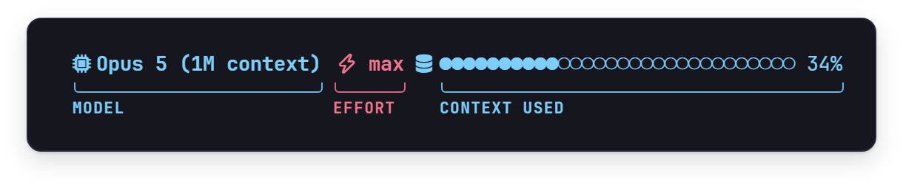
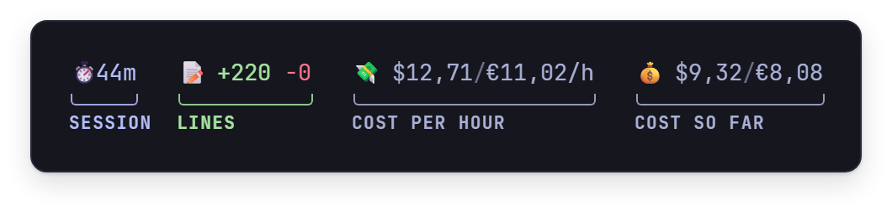
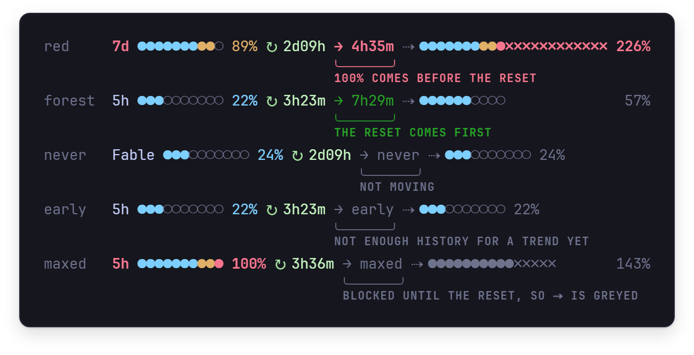
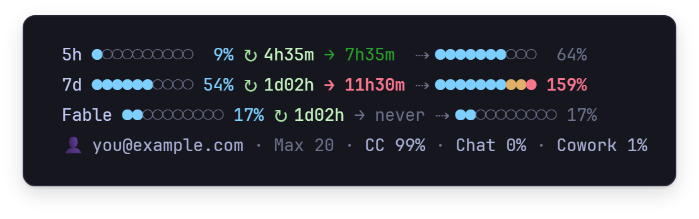
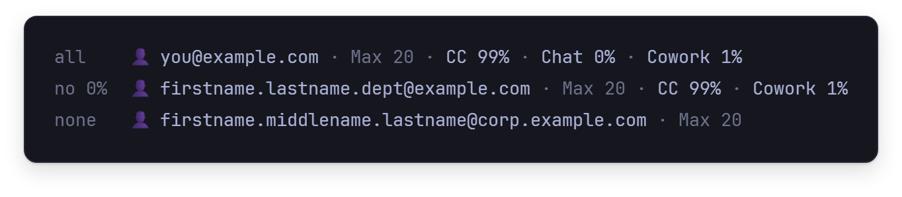

<sub>[StatusAI](../../README.md) / [Documentation](../README.md)</sub>

# Reading the status line

StatusAI is Claude Code's status line: cship's model line with a meta segment appended, two rows of
tokens for the whole agent tree, and a row for each usage limit. This page goes through them from
top to bottom.


<details>
<summary>The same sample, as text</summary>

```
  Opus 5 (1M context) ⚡ max  ●●●●●●●●●●○○○○○○○○○○○○○○○○○○○○ 34%   ⏱ 44m   📝 +220 -0   💸 $12,71/€11,02/h   💰 $9,32/€8,08
 │🔺🪵 0,238k    🔺🌿 9,444k    🔺🌳 9,682k    💾🪵 1,447M    💾🌿 240,7k    💾🌳 1,687M    🔧🪵    101    🔧🌿    129    🔧🌳    230
 │🔻🪵 286,9k    🔻🌿 1,549k    🔻🌳 288,5k    📖🪵 58,60M    📖🌿 4,830M    📖🌳 63,43M    🪙🪵 60,33M    🪙🌿 5,081M    🪙🌳 65,42M
 5h ●○○○○○○○○○  9% ↻ 4h35m → 7h35m  ⇢ ●●●●●●●○○○        64%  👤 you@example.com · Max 20 · CC 99% · Chat 0% · Cowork 1%
 7d ●●●●●●○○○○ 54% ↻ 1d02h → 11h30m ⇢ ●●●●●●●●●●✗✗✗✗✗✗ 159%  Fable ●●○○○○○○○○ 17% ↻ 1d02h → never ⇢ ●●○○○○○○○○ 17%
```

</details>

The sample is drawn by the current binary from the render tests' `showcase` fixture: a
mid-session payload, a main thread with two sub-agents, and an example set of limits. In a
terminal every figure has its colour, and several of the colours mean something; they are described
below, row by row. Every picture on this page is a render the tests hold the binary to, drawn cell
for cell by the [figure generator](../assets/README.md).

## Why the whole tree

Claude Code's status line payload has no cumulative token figure at all, and everything it *does*
expose covers the main conversation only. Sub-agent turns are not in the main transcript: every
child, at any depth, writes its own file under `<session>/subagents/`.

Measured across three real sessions, sub-agents were **28%, 78% and 98%** of total consumption;
[accounting.md](../reference/accounting.md#what-the-sub-agents-spend) has the figures.

A status line that reads only `transcript_path` can therefore miss most of what a session spends.
StatusAI walks the whole tree. How it counts, and why the obvious ways double-count, is in
[accounting.md](../reference/accounting.md).

## The model line

The model line is cship's: the model, the effort level and the context bar.



StatusAI appends the meta segment to it:



| segment | shows |
|---|---|
| `⏱ 44m` | how long the session has run |
| `📝 +220 -0` | lines added and removed, once there are any |
| `💸 $12,71/€11,02/h` | cost per hour so far, once the session is 72 seconds old |
| `💰 $9,32/€8,08` | cost so far |

The cost is Anthropic's **client-side list-price estimate**, converted to euros at the European
Central Bank's daily reference rate. On a subscription plan nobody is billed that amount, so read it
as a gauge of relative effort rather than an invoice. A figure the payload did not carry reads `—`,
never `0`.

With starship installed, a prompt line comes before the model line, with the directory, git, RAM,
the GPU and the time. The sample leaves it out; [install.md](install.md) says what it needs.

## The token grid


The figure is the sample's grid drawn at 120 columns, where its gutters are two spaces; at 141 they
are four. The gutters are all that changes with the width.

The two rows are split by direction of travel:

| | columns 1 to 3 | columns 4 to 6 | columns 7 to 9 |
|---|---|---|---|
| **top: what left** | 🔺 fresh prompt | 💾 written to cache | 🔧 tool calls |
| **bottom: what came back** | 🔻 output generated | 📖 served from cache | 🪙 all token types summed |

Columns 7 to 9 don't follow the send and receive idea. They are the summary group, a count above
and a total below.

Each group has three columns, one per scope, and a scope keeps its column all the way across:

- 🪵 **trunk**, this main conversation (columns 1, 4, 7)
- 🌿 **branch**, everything the sub-agents did (columns 2, 5, 8)
- 🌳 **tree**, both together (columns 3, 6, 9)

The colours back this up (main dim, sub lavender, total bold cyan), so you can read a scope straight
down without looking at the glyphs.

Units: `k` is 1.000 tokens, `M` is 1.000.000 and `G` is 1.000.000.000. A value has four significant
figures and is always exactly six characters wide. Tool calls carry no unit.

The arrows are relative to **you**, not to the model: 🔺 left, 🔻 came back. 💾 and 📖 have no
arrow on purpose. A direction on them invites reading it against the cache rather than against the
conversation, and the two frames disagree.

### Reading the sample

- `🔺🪵 0,238k` against `📖🪵 58,60M`: the main thread sent 238 fresh prompt tokens while
  58,6 million came back out of the cache. That ratio is caching at work, with the same context
  re-read every turn at a tenth of the rate.
- `🪙🌿 5,081M` against `🪙🪵 60,33M`: the sub-agents against the main thread, a comparison nothing
  else on the bar shows.
- `🔧🌿 129` against `🔧🪵 101`: the sub-agents made more tool calls than the main thread on a
  twelfth of the tokens, which is what delegation should look like.

## The limit rows

There are up to three rows, one per usage limit: `5h` is the five-hour session, `7d` the week, and
the third, named after its model (`Fable` in the sample), is the weekly limit scoped to one model.
Each reads left to right. The rows in this figure are the render tests' `shot` fixture, which draws
both colours of `→`:


- The bar and the percentage show where the limit is now. The bar has ten cells, one per tenth
  begun: cyan, amber from the eighth, red on the tenth. The percentage turns amber at 70% and red at
  90%, and the label takes the colour the server gives the limit's severity.
- `↻` is the time until this limit resets, or `—` when the server did not say.
- `→` is how soon 100% arrives at the pace of the last 60 minutes, and its colour says whether that
  matters: **red** when 100% comes before the reset, so the window runs out, and **forest green**
  when the reset comes first, so at this pace it never does. It is grey when there is no reset time
  to compare with. It reads `early` until there is enough history for a trend, `maxed` at 100% and
  `never` when the limit is not moving.
- `⇢` is where the limit will stand at its reset if the pace holds, capped at 300%. Past 100% the
  bar grows red `✗` cells. A row already at 100% draws this whole segment grey, like a disabled
  control: the row is blocked until the reset, so where it is heading does not apply yet.

Here is every state `→` can be in, each one a row the render tests draw:



When the line is wide enough the rows sit in two columns, `5h` beside the account and `7d` beside
the scoped row. Otherwise they stack, with the account on a line of its own. This is the sample at
100 columns:



How the projection is built, and which of the server's meters are drawn, is in
[limits.md](../reference/limits.md).

## The account line


The signed-in account and its plan, then how this week's usage splits across products: Claude Code,
chats, Cowork, and any other product while it is above 0%. The split is shown in whole entries or
not at all. When room runs short it drops its 0% entries first and then goes altogether, so it
never wraps. Here it is beside longer and longer addresses, at 141 columns:



`👤 not signed in` means Claude Code is not signed in to a Claude account, with an API key for
instance; the limit rows need one.

## When a row says ⚠

A figure that could not be read never looks like a real zero. A source that failed is named in a
**red** `⚠` row at the foot of the block, and the figure itself reads `—`. That covers a payload
that cannot be read, a missing cost or context figure, a transcript that should exist and does not,
a usage fetch that is suspended or has failed twice in a row, and cship printing nothing. A
brand-new session, before its first reply, is not a failure and says nothing.

A usage fetch that fails once (when you're offline, say) is quiet. The limit rows keep showing the
last good fetch, with its countdowns where they stood then, or are left out if there has been none,
and the next render tries again. If that fails too, a red row names the reason and says how old the
rows are, `⚠ usage — timed out after 3 s; the limit rows are 2m old`, until a fetch succeeds.

Two more rows can appear there, and neither is a failure:

- an amber notice, when the usage API sends a limit this status line does not draw yet: the limit
  is named, pending a review of the code, rather than drawn on trust;
- a red on-credit alarm, always last, when usage is being billed beyond the plan:
  `⚠ on credit — $12,40 spent beyond the plan this period`.

All three at once, in their order, under the last limit row:


Every reason and when it appears is in [layout.md](../reference/layout.md#the--row).
