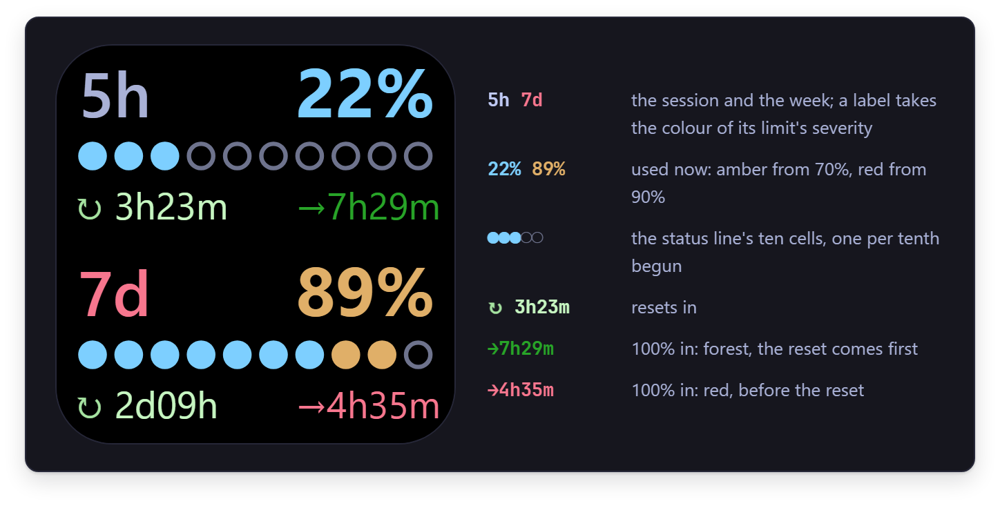
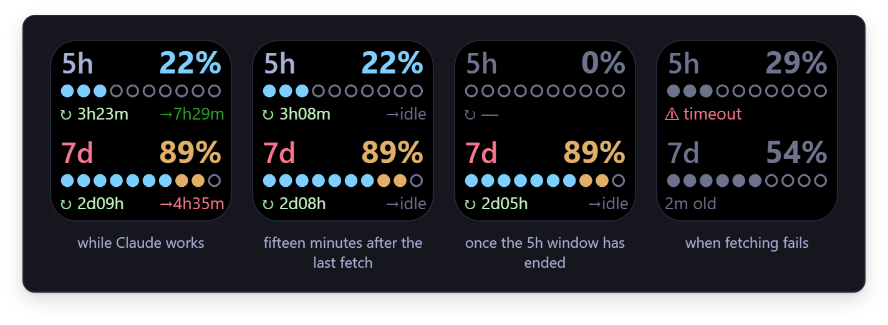

<sub>[StatusAI](../../README.md) / [Documentation](../README.md)</sub>

# The Stream Deck key

One key on an Elgato Stream Deck that shows your 5h and 7d limits the way the status line draws
them, and opens a Claude Code terminal when you press it. This page says what the key shows, what
a press does, when its numbers are fetched, what it costs and how to install it.



The key is drawn by `statusai.exe` itself. Stream Deck starts a copy of it as a plugin, and that
process stays up for as long as the app does. It reads the figures the status line shares between
your sessions, so the key and the status line never disagree, and it never polls: it waits for
those figures to change, for Claude to write something, or for you to press the key.

## What it shows

Two meters, `5h` above `7d`, each with the parts of a [limit row](reading-the-status-line.md#the-limit-rows)
that fit on a key:

- The label, in the colour the server gives the limit's severity, and the percentage used:
  amber from 70%, red from 90%.
- The bar: the status line's ten cells, one per tenth begun, cyan, amber from the eighth and red on
  the tenth.
- `↻`, the time until the limit resets, or `—` when the server did not say. It counts down by
  itself, a minute at a time.
- `→`, how soon 100% arrives at the pace of the last hour: **red** when that comes before the
  reset, **forest green** when the reset comes first, grey when there is no reset time to compare
  with. It reads `early` until there is a trend, `maxed` at 100% and `never` when the limit is not
  moving.

The key leaves out what a row has more: the projection `⇢`, and the third row for one model.



| the key | means |
|---|---|
| `→idle`, in grey | Nothing has fetched for five minutes, which is what happens when Claude is not working. The pace the time to 100% was worked out from has stopped, so the key no longer states one. |
| a meter at `0%`, grey, with `↻ —` | That limit's window has ended since the last fetch. What was used in it is gone, and the next window's reset time is not known until something fetches. |
| both meters grey, `⚠` and a reason in red | The usage could not be fetched twice in a row: `timeout`, `offline`, `no token`, `HTTP 429`. The figures are the last good ones, and the line under the second meter says how old they are. It is the status line's own [`⚠` row](reading-the-status-line.md#when-a-row-says-), cut to fit. |
| `—` where a percentage would be | There is no such figure: nothing has been fetched yet, nobody is signed in, or the server sent no such limit. |

## What a press does

| press | does | runs |
|---|---|---|
| short: released within half a second | a new tab in the Windows Terminal window you used last, or a new window when there is none on this desktop | `wt.exe -w 0 nt` |
| long: held for half a second | a new Windows Terminal window; it opens while the key is still down | `wt.exe -w new` |

Both open Windows Terminal's default profile, so the key opens Claude Code when that profile runs
it. And both end with the terminal in front of whatever you were working in. Windows does not do
that for a program in the background, which gets a flashing taskbar button instead, so the key
sees to it: the terminal window is brought up, a minimised one is brought back, and the tab
opens in the terminal window that was on top of your others.

A short press acts when the key comes up, because until then it could still become a long one.

## When the numbers are fetched

The key fetches nothing itself. It draws the figures the status line keeps for all your sessions,
and is told the moment they change.

- **A terminal session is open.** Its status line fetches the usage once a minute, as it always
  has, and the key follows within a tenth of a second or so. The two share that one fetch: when
  the key has just made it, the status line draws the same figures and fetches nothing.
- **Claude is working, but not in a terminal**: in the VS Code extension, say, where there is no
  status line. Every session of every kind writes its transcripts under `~/.claude/projects`. The
  key waits on that folder, and while something is being written there it starts
  `statusai --refresh` once every 62 seconds, which fetches the way a render does. The first write
  after a quiet spell refreshes at once, and the last one is followed by one more refresh a minute
  later.
- **Nothing is happening.** Then nothing is fetched. The key keeps counting its countdowns down
  and shows `→idle` after five minutes.

So the key adds no call to Anthropic while a terminal is open, at most 58 an hour while Claude
works elsewhere, and none while Claude is idle. It also fetches nothing while it is not visible,
on another page or profile: the write is remembered, and the refresh comes when the key is back.

Usage this PC cannot see, from another device or from a chat in the browser, shows up at the next
fetch: when Claude next writes something here, or when you press the key, since the new session's
status line fetches as it starts.

## What it costs

Measured on the machine it was written on, with Stream Deck 7.6 and a Stream Deck XL, in half an
hour of Claude working in the VS Code extension with no terminal open:

| | |
|---|---|
| the process that stays up | 13,2 to 13,5 MB of memory in use, 3,8 to 4,0 MB of it private; 3 threads |
| its processor time | 0,22 s in 33 minutes, a hundredth of a percent of one core |
| one refresh, every 62 seconds | a second `statusai.exe` that lives for as long as the fetch takes, 0,3 to 0,6 s: 0,05 s of processor time, and 19 MB of memory for that long |
| one redraw | well under a millisecond, and one message of about 4 kB to the app |
| one press | a second `statusai.exe` for the second or so it takes to open the terminal and bring it to the front; nothing of it stays in the process that stays up |
| on disk | the plugin's folder holds its own copy of `statusai.exe`, 4,9 MiB |

When something else does the fetching, as a terminal's status line does, the process starts no
refresh and only redraws: 0,02 s of processor time in eight minutes of that. While nothing
happens it redraws once a minute, for the countdowns.

How it works, and why it is built this way, is in
[architecture.md](../reference/architecture.md#the-stream-deck-key) and
[the design record](../design/stream-deck.md).

## Install

You need the Stream Deck app, 6.5 or later (it was built and tried with 7.6), Windows Terminal,
and StatusAI [installed](install.md) as your status line. It was tried on a Stream Deck XL; the
picture is square, and the app scales it to the key of the device it is on.

The key is not in a release yet, so for now it comes from a build of the repository. With the
[build](install.md#build-from-source) made:

```powershell
./scripts/Deploy.ps1 -Deck
```

That puts the plugin's folder, `com.sixfive7.statusai.sdPlugin`, in
`%APPDATA%\Elgato\StreamDeck\Plugins`, with a copy of the `statusai.exe` it has just deployed as
your status line. Then:

1. Quit Stream Deck from its icon in the notification area and start it again. It finds a new
   plugin when it starts.
2. In the app, find *StatusAI* in the list of actions and drag *Claude Code* onto a key.

After that `./scripts/Deploy.ps1` keeps the plugin's copy in step with the status line's whenever
it deploys a build; see [development.md](../development.md#deploying).

## When something is wrong

| what you see | what to do |
|---|---|
| the key shows the plugin's blank picture, `—` on both meters, and stays that way | The plugin is not running, or has nothing to draw yet. `%APPDATA%\Elgato\StreamDeck\logs\com.sixfive7.statusai0.log` holds one line for every start, `statusai 1.0.0 of <date> started as the Stream Deck plugin`, and one for anything that stopped it. No line at all means the app did not start it: quit Stream Deck and start it again. |
| a yellow warning sign flashes on the key when you press it | Windows Terminal could not be started. The same log has Windows' error number for why: 2 is "not found", which is Windows Terminal not being installed. |
| the terminal opens behind the window you are in, its taskbar button flashing | Windows refused every way the key has of bringing it forward. Nothing is logged for this; [development.md](../development.md#the-presses-on-the-live-desktop) has the test that shows which way works on your PC. |
| both meters grey, `⚠ no token` | Claude Code is not signed in with a Claude account, as with the [status line](install.md#when-something-is-missing). |
| the figures are old while Claude is working | The key only refreshes while it is visible. Otherwise, look at the log. |
| a press opens a shell and not Claude Code | The key opens Windows Terminal's default profile. Make the profile that runs `claude` the default one, in Windows Terminal's settings under *Startup*. |

## Uninstall

Remove the key from your profile, quit Stream Deck, and delete the plugin's folder:

```powershell
Remove-Item -Recurse "$env:APPDATA\Elgato\StreamDeck\Plugins\com.sixfive7.statusai.sdPlugin"
```
